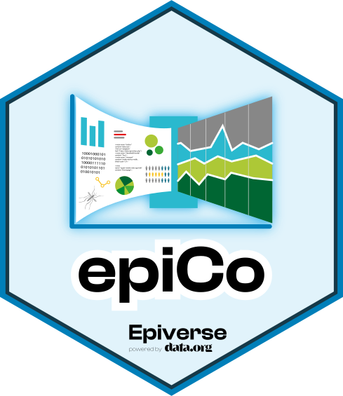

<!-- README.md is generated from README.Rmd. Please edit that file -->

# epiCo 

**epiCo** provides statistical and visualization tools for the analysis of demographic indicators, and spatio-temporal behavior and characterization of outbreaks of vector-borne diseases (VBDs) in Colombia. 

<!-- badges: start -->
[](https://opensource.org/licenses/MIT)
[](https://github.com/epiverse-trace/epico/actions/workflows/R-CMD-check.yaml)
[](https://app.codecov.io/gh/epiverse-trace/epico?branch=main)
[](https://www.reconverse.org/lifecycle.html#maturing)
[](https://zenodo.org/doi/10.5281/zenodo.11579611)
<!-- badges: end -->

## Installation

You can install the stable version of *epiCo* from CRAN with:

``` r
install.packages("epiCo")
```

You can also install the development version of *epiCo* from
[GitHub](https://github.com/) with:

``` r
# install.packages("remotes")
remotes::install_github("epiverse-trace/epiCo")
```

## Motivation

When reviewing the current epidemiological bulletins published by the local Secretariats of Health in Colombia, we identified an opportunity to create a tool to:
- Include spatial and demographic risk assessments into their routine epidemiological reports to better identify population groups for potential interventions.
- Facilitate the understanding of the different epidemiological profiles within a region in Colombia regarding the onset, duration, magnitude, and frequency of the outbreaks.
- Strengthen the transparency of the methods used for the outbreak analysis.
- Provide more informative context by performing spatial correlation analysis.

The package allows for interoperable analyses of linelist data from
[SIVIGILA](https://www.ins.gov.co/Direcciones/Vigilancia/Paginas/SIVIGILA.aspx) (accessible using the Epiverse-TRACE package [sivirep](https://github.com/epiverse-trace/sivirep)) with spatial and demographic data (accessible using the Epiverse-TRACE package [ColOpenData](https://epiverse-trace.github.io/ColOpenData/)). 

*epiCo* can be used to perform the following main tasks at the municipality, departmental, or national level:

1. To identify demographic vulnerabilities from linelist data and the socioeconomic census, including risk assessment based on age, gender, occupation, and ethnicity.
2. To assess hot-spot analyses (as Local Moran's index) based on real travel distances in Colombia estimated from [Bravo-Vega C., Santos-Vega M., & Cordovez J.M. (2022)](https://doi.org/10.1371/journal.pntd.0011117).
3. To generate automated outbreak characterization (onset, duration, magnitude, and frequency) using traditional methods as the [endemic channel](https://iris.paho.org/handle/10665.2/8562) and poisson tests for unusual behavior.
4. *Future features will include correlation analyses between categorical socioeconomic data, climate time series and epidemiological data, nowcasting assessment, underreport estimation, and short-term forecasting.*

All features are performed automatically from epidemiological, demographic, spatial, and socioeconomic data published by Colombian institutions, but methods can also be customized as well as input data, so hypothetical information can be tested within the package.

## Modules

**epiCo** contains three modules documented in the following vignettes:

1. [Demographic analyses with epiCo](https://epiverse-trace.github.io/epiCo/articles/demographic_vignette.html)
2. [Building an Endemic Channel with epiCo](https://epiverse-trace.github.io/epiCo/articles/endemic_channel.html)
3. [Spatiotemporal analyses with epiCo](https://epiverse-trace.github.io/epiCo/articles/spatiotemporal_vignette.html)

## Development

### Lifecycle

This package is currently a *maturing* product, as defined by the [RECON software
lifecycle](https://www.reconverse.org/lifecycle.html). This means that
essential features and mechanisms are functional, documented, and tested.
However, the package is open to receive code reviews and is being socialized with expert users.

### Contributions

Contributions are welcome via [pull
requests](https://github.com/epiverse-trace/epiCo/pulls).

Contributors to the project include:

  - [Juan D. Umaña](https://github.com/juan-umana) (author)
  - [Juan Montenegro-Torres](https://github.com/Juanmontenegro99) (author)
  - [Julian Otero](https://github.com/jd-otero) (author)
  - [Hugo Gruson](https://github.com/Bisaloo) (contributor)
  - [Mauricio Santos-Vega](https://github.com/mauricio110785) (advisor)
  - [Catalina Gonzalez Uribe](https://academia.uniandes.edu.co/AcademyCv/cgonzalez) (advisor)
  - [Juan Manuel Cordovez](https://academia.uniandes.edu.co/AcademyCv/jucordov) (advisor)

We acknowledge the contribution of collaborators in Universidad de los Andes, Pontificia Universidad Javeriana, Instituto Nacional de Salud de Colombia, Secretaría de Salud del Tolima, and Epimodelac Course attendees who provided insightful feedback for the package.

### Code of Conduct

Please note that the epiCo project is released with a [Contributor
Code of
Conduct](https://contributor-covenant.org/version/2/0/CODE_OF_CONDUCT.html).
By contributing to this project, you agree to abide by its terms.

### Funding

This work is part of the TRACE-LAC research project funded by the International Research Centre (IDRC) Ottawa, Canada.[109848-001-].
